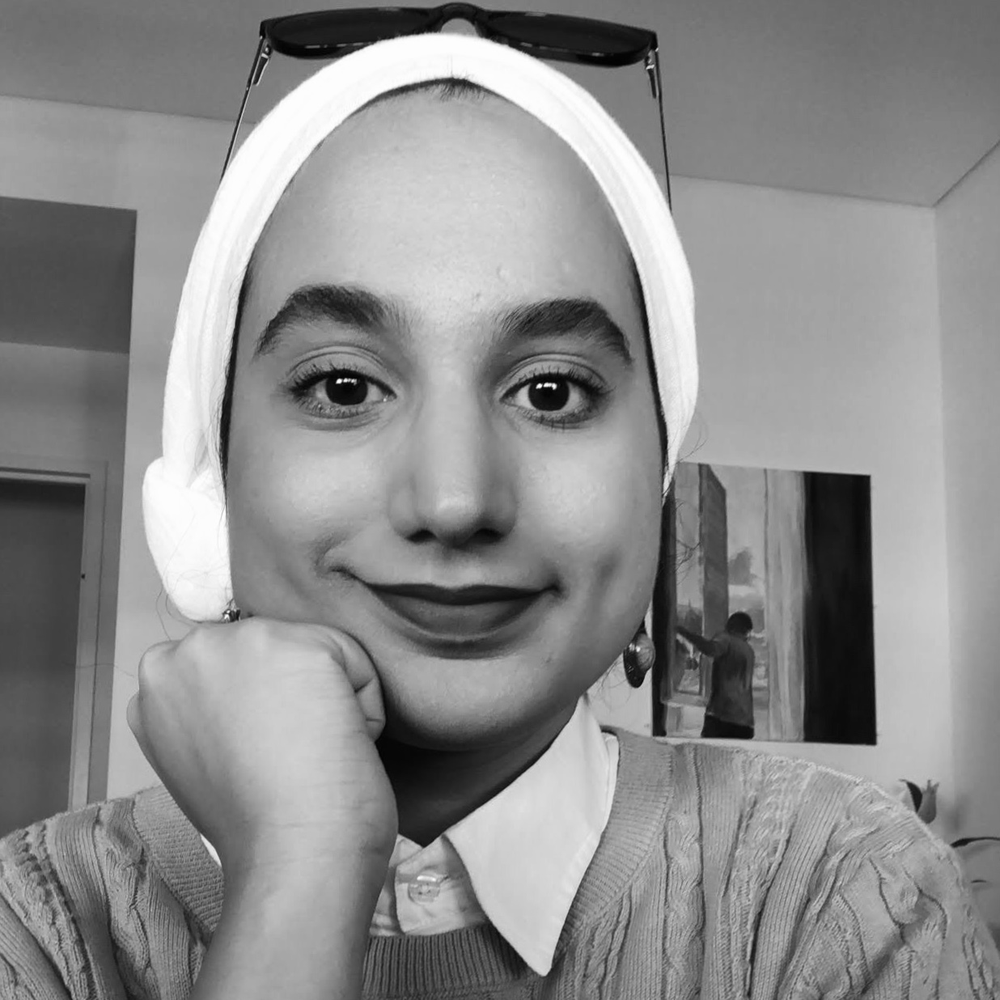
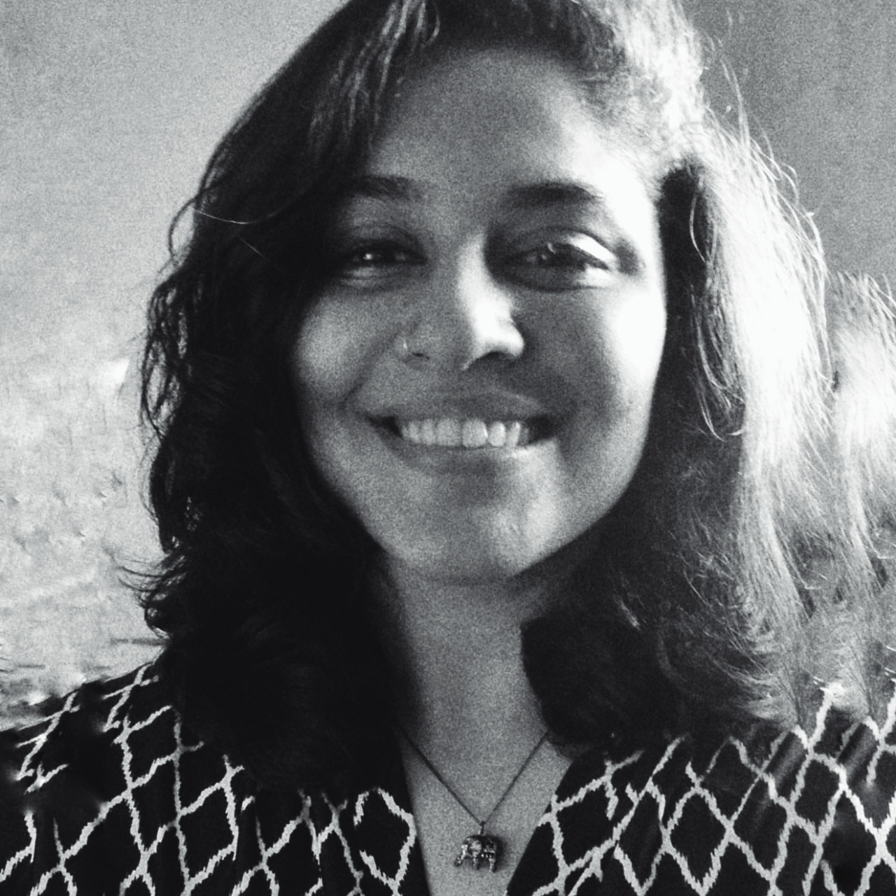

## Welcome to Poiesis Social Art!

*[~ PO-ee-sis; from Ancient Greek: ποίησις  is "the activity in which a person brings something into being that did not exist before" or, to create ~]*

Our collective will to start a podcast that intersected our interests with art and community was laid down in 2015, and over the next four years this will became a reality as Poiesis.SocialArt in August 2019. Poiesis is a digital academic archive run by both of us, visual artists & educators, Dania Shahkhan and Maha Minhaj. We archive, curate and write about the practices of local and international socially engaged artists, in the form of visual media and academic podcasts

**Instagram Handle:** [@poiesis.socialart](https://www.instagram.com/poiesis.socialart/) ; **Soundcloud Handle:** [Poiesis.SocialArt](https://soundcloud.com/user-384729018)

|  |  |
|:-------------------------:|:-------------------------:|
|  |  |
| [Dania Shahkhan](https://www.instagram.com/dania.sk.art/)  |   [Maha Minhaj](https://www.instagram.com/_thegentlewoman_/)  |

## Goal

We aim to grow as a resource bank for students, practitioners and researchers.

We also hope to eventually transform this digital space into a tangible platform that enables creators and practitioners to pursue SEA (Socially Engaged Art) in Pakistan and all around the world.

### You can find out more about our projects, access resources or scroll through our archive via these link or from the sidebar

- [projects](projects.md)
- [resources](resources.md)
- [archive](archive.md)
